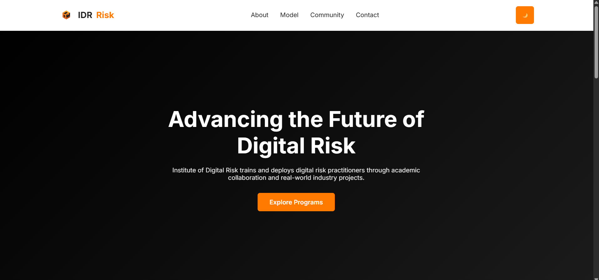

# Institute-of-Digital-Risk
# Institute of Digital Risk (IDR) – Landing Page

This project is a responsive landing page for the **Institute of Digital Risk (IDR)**, an industry-led training and deployment institute focused on digital, cyber, and technology risk.
## Website Preview

)

## Features

- Responsive design for desktop and mobile
- Sticky navigation bar with smooth scrolling
- Dark / Light mode toggle
- Animated service cards on scroll
- Mobile hamburger menu
- Contact form for registering interest
- SVG icons and modern UI design

## Technologies Used

- HTML5 (semantic structure)
- CSS3 (Flexbox, Grid, animations)
- JavaScript (menu toggle, dark mode, scroll effects)

## Sections Included

1. Hero Section – Mission statement and call-to-action
2. About IDR – Overview of the institute
3. Service Model – Academy, Innovation, Advisory, Deployment
4. Community – Who the institute serves
5. Contact – Register interest form

## Logo Design

The IDR logo uses a geometric cube to represent structure, resilience, and digital risk frameworks.  
The orange and black color palette symbolizes innovation, technology, and security.  
A clean sans-serif typography ensures a modern and professional identity suitable for a digital risk institute.

## Author

Gayatri Pawar
